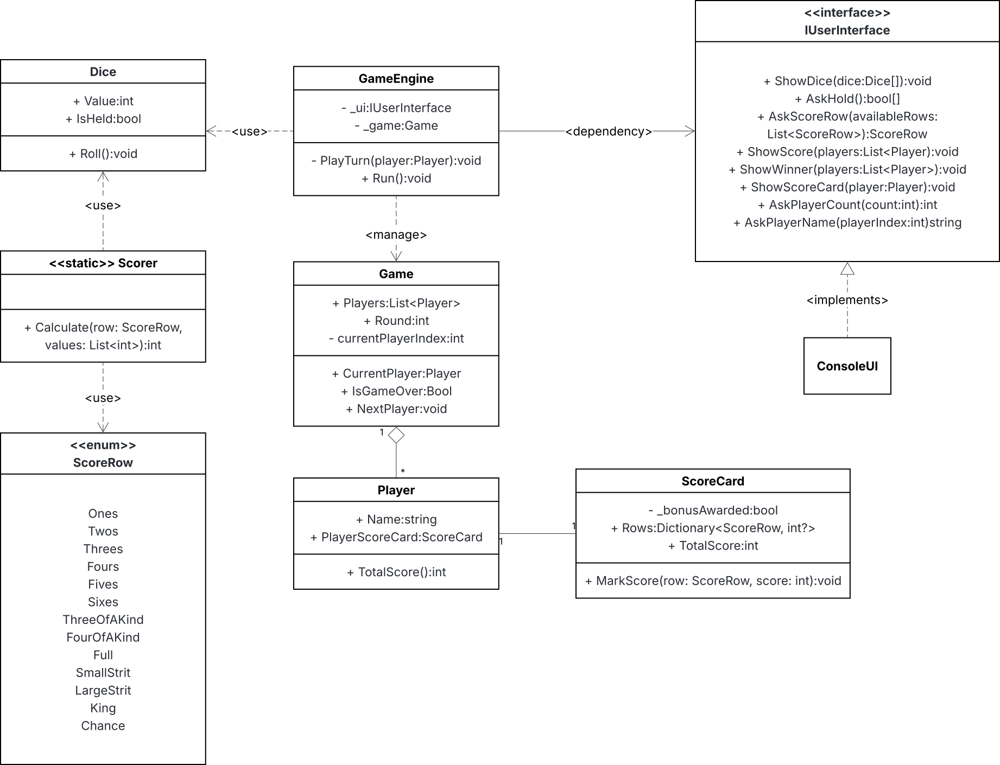

# DiceGame
Kamil Janik
 
Konsolowa implementacja gry w kości dla 2–4 graczy. Napisana w C# (.NET 8) z naciskiem na separację warstw i testowalność logiki.

---

## Wymagania
 
- [.NET 8 SDK](https://dotnet.microsoft.com/download/dotnet/8.0)
- System: Windows, macOS lub Linux

---

## Uruchomienie
 
```bash
# Klonowanie repozytorium
git clone https://github.com/Jankess0/DiceGame
cd DiceGame
 
# Uruchomienie gry
cd DiceGame.ConsoleUI
dotnet run
 
# Uruchomienie testów
cd DiceGameTests
dotnet test
```

---

## Zasady gry
 
- Gra przeznaczona dla 2–4 graczy.
- Każda tura składa się z maksymalnie 3 rzutów pięcioma kośćmi.
- Po pierwszym rzucie gracz może zaznaczyć kości do zatrzymania — niezatrzymane są przerzucane.
- Po zakończeniu fazy rzutów gracz wybiera jeden wiersz z karty punktów, w oparciu o który przyznawane są punkty.
- Każdy wiersz można wykorzystać tylko raz; jeśli kombinacja nie pasuje, gracz wpisuje 0.

### Tabela górna (sekcja Upper)
 
| Wiersz | Punktacja |
|---|---|
| Ones–Sixes | Suma oczek danej wartości |
| **Bonus** | +35 pkt, jeśli suma górnej sekcji ≥ 63 |
 
### Tabela dolna (sekcja Lower)
 
| Wiersz | Punktacja |
|---|---|
| Three of a Kind | Suma wszystkich kości |
| Four of a Kind | Suma wszystkich kości |
| Full | 25 pkt |
| Small Straight | 30 pkt |
| Large Straight | 40 pkt |
| King | 50 pkt |
| Chance | Suma wszystkich kości |

---

## Struktura projektu
 
```
DiceGame.sln
├── DiceGame.Core/           # Logika i modele — niezależne od UI
│   ├── GameEngine/
│   │   ├── Game.cs          # Stan gry (gracze, runda, kolejność)
│   │   └── GameEngine.cs    # Przebieg tury: faza rzutów + faza punktacji
│   ├── Logic/
│   │   └── Scorer.cs        # Obliczanie punktów dla każdej kombinacji
│   ├── Models/
│   │   ├── Dice.cs          # Kostka: wartość + flaga IsHeld
│   │   ├── Player.cs        # Gracz: imię + karta punktów
│   │   ├── ScoreCard.cs     # Karta punktów: wiersze, bonus, suma
│   │   ├── ScoreRow.cs      # Enum 13 wierszy z atrybutem sekcji
│   │   ├── ScoreRowExtensions.cs  # Odczyt sekcji przez refleksję
│   │   └── ScoreSection.cs  # Enum Upper/Lower + atrybut ScoreSections
│   └── UI/
│       └── IUserInterface.cs  # Kontrakt komunikacji silnika z UI
│
├── DiceGame.ConsoleUI/      # Implementacja konsolowa
│   ├── ConsoleUserInterface.cs  # Implementacja IUserInterface
│   └── Program.cs           # Punkt wejścia, konfiguracja i start gry
│
└── DiceGameTests/           # Testy jednostkowe (xUnit)
    ├── ScorerTests.cs       # Pokrycie wszystkich kombinacji Scorer
    └── ScoreCardTests.cs    # Testy przyznawania bonusu i sumy punktów
```

---

## Diagram Klas


---
 
## Decyzje projektowe
 
### Separacja warstw przez `IUserInterface`
 
Kluczową decyzją jest oddzielenie `GameEngine` od jakiejkolwiek wiedzy o tym, jak wygląda interfejs użytkownika. Silnik komunikuje się wyłącznie przez interfejs `IUserInterface`, który definiuje kontrakt oparty na `async/await`:
 
```csharp
public interface IUserInterface
{
    Task ShowDiceAsync(Dice[] dices);
    Task<bool[]> AskHoldAsync(Dice[] currentDices);
    Task<ScoreRow> AskScoreRowAsync(List<ScoreRow> availableRows);
    Task ShowScore(List<Player> players);
    Task ShowWinnerAsync(List<Player> players);
    Task ShowScoreCardAsync(Player player);
    Task<int> AskPlayerCountAsync();
    Task<string> AskPlayerNameAsync(int playerIndex);
}
```

Dzięki temu możliwa jest podmiana implementacji konsolowej na graficzną (np. .NET MAUI) bez żadnych zmian w logice gry.

### Podział odpowiedzialności: `Game` vs `GameEngine`
 
`Game` przechowuje wyłącznie stan: listę graczy, numer rundy i indeks aktualnego gracza. `GameEngine` zarządza przebiegiem: fazą rzutów i fazą punktacji. Podział ten ułatwia testowanie stanu gry w izolacji od logiki sterowania.
 
### `ScoreRow` z atrybutem sekcji
 
Zamiast rozdzielać wiersze punktacji na dwie osobne kolekcje lub korzystać z instrukcji `switch`, każda wartość enuma `ScoreRow` jest ozdobiona atrybutem `[ScoreSections(ScoreSection.Upper/Lower)]`. Odczyt sekcji odbywa się przez refleksję w klasie `ScoreRowExtensions`:
 
```csharp
public static ScoreSection GetSection(this ScoreRow row)
{
    var field = typeof(ScoreRow).GetField(row.ToString())!;
    return field.GetCustomAttribute<ScoreSectionsAttribute>()!.Section;
}
```
 
Pozwala to na sprawdzanie warunku bonusu górnej sekcji bez twardego kodowania listy wierszy.

### Asynchroniczny przepływ od podstaw
 
Wszystkie metody `IUserInterface` zwracają `Task`, a `GameEngine.RunAsync()` jest w pełni asynchroniczny. Decyzja ta podjęta została od razu, by uniknąć konieczności przebudowy interfejsu przy ewentualnym dodaniu frontendu graficznego (MAUI, Blazor), gdzie blokowanie wątku UI jest niedopuszczalne.

### `Scorer` jako klasa statyczna
 
Obliczanie punktów nie wymaga żadnego stanu — funkcja `Calculate(ScoreRow, List<int>)` jest czystą funkcją odwzorowującą kombinację kości na wynik. Klasa statyczna wyraża tę bezstanowość wprost i ułatwia testowanie jednostkowe bez potrzeby tworzenia instancji.

---

## Decyzje funkcjonalne
 
### Kości są współdzielone między turami
 
Tablica `Dice[]` jest tworzona raz w `GameEngine.RunAsync()` i przekazywana do każdej tury. Na początku każdej tury flagi `IsHeld` są zerowane. Eliminuje to zbędną alokację przy każdej turze i upraszcza śledzenie stanu kości.
 
### Przerwanie rzutów przy zatrzymaniu wszystkich kości
 
Jeśli gracz zdecyduje się zatrzymać wszystkie pięć kości przed trzecim rzutem, pętla rzutów kończy się wcześniej:
 
```csharp
if (heldDices.All(h => h)) break;
```
 
Odpowiada to naturalnemu zachowaniu gracza i eliminuje zbędny trzeci rzut bez wyniku.
 
### Gracz zawsze musi wybrać wiersz
 
Zgodnie z zasadami gry gracz musi wybrać wiersz nawet jeśli żadna kombinacja nie pasuje — oznacza to wpisanie 0 punktów. `GameEngine` nie waliduje trafności wyboru; ocena należy do gracza.
 
### Bonus górnej sekcji sprawdzany przy każdym zapisie
 
`ScoreCard.MarkScore` po każdym zapisie sprawdza, czy suma górnej sekcji osiągnęła 63 punkty, i jednorazowo przyznaje bonus 35 punktów. Flaga zabezpiecza przed wielokrotnym doliczeniem bonusu.

---

## Testy
 
Testy napisane w xUnit, projekt `DiceGameTests`.
 
### `ScorerTests` — pokrycie kombinacji
 
Każda z 13 kombinacji objęta jest testem parametrycznym `[Theory]` sprawdzającym co najmniej dwa przypadki: pasującą kombinację i brak dopasowania.
 
| Metoda testowa | Testowane przypadki |
|---|---|
| `Calculate_Ones` | jedna jedynka, pięć jedynek, brak jedynek |
| `Calculate_Sixes` | pięć szóstek, trzy szóstki |
| `Calculate_ThreeOfAKind` | trójka z piątkami, trójka z szóstkami, brak trójki |
| `Calculate_FourOfAKind` | cztery + różna, cztery + ta sama, brak czwórki |
| `Calculate_Full` | full house, brak full house |
| `Calculate_SmallStraight` | trzy warianty małego strita, brak strita |
| `Calculate_LargeStraight` | 1–5, 2–6, brak strita |
| `Calculate_King` | pięć takich samych, brak |
| `Calculate_Chance` | suma pięciu takich samych, suma mieszana |
 
### `ScoreCardTests` — bonus i suma
 
| Przypadek | Opis |
|---|---|
| Wynik 63 w sekcji Upper | Suma = wynik + 35 pkt bonusu |
| Wynik 62 w sekcji Upper | Suma = wynik, brak bonusu |
| Wynik 65 w sekcji Lower | Suma = wynik, bonus nie dotyczy sekcji Lower |
 
